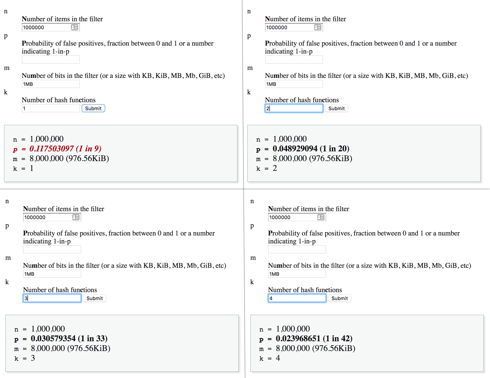

Bloom Filters in Redis
=====
In an industry where “Choose the right tool for the right job” is a mantra, whoever has the richest toolset is ~~king~~ queen
What are bloom filters

---

Checking for presence of an element in a set is a task we, as programmers, do very often and in many different scenarios. As those sets grow bigger and the scenarios more complex, often we start noticing performance decrease. If you've ever been in this position before - read on; we're going to talk about a valuable tool you can add to your toolset. 

**Bloom Filters** are a data structure that enables you to store information about the presence of an element in a set in a very small space of a fixed size.  
 
There's a catch though. The space optimisation comes at the cost of precision; a bloom filter can guarantee the **absence** of an element from a set, but it can only give it's best bet about it's presence. This is why you’ll often see it described more precisely as a “probabilistic data structure”.

"Ok, so why would I need this if I can't trust it?" you might ask. Well, you actually can trust it when it says an element is not present in a set. The uncertainty comes only with the positive responses.

Let's look at a few cases where a bloom filter would be useful.
 
# Use cases

One of the most classic ones would be a simple **spellchecker**. You get the whole dictionary and add every word to the bloom filter. When you get a text you need to spellcheck, check every word against the filter. If you get a negative result back for a word, you're sure that it's misspelled and you can feel confident in highlighting it as one. 

Sometimes, however, you'd have a misspelled word that the filter marked as "maybe present" and then you'd fail to mark it as misspelled. But considering that we didn't need to store the entire dictionary in memory and we control the rate of false positives, this is probably an acceptable trade off. 
 
 Other common use cases are checking for blocked IP addresses, or taken usernames, filtering out already seen recommendations, network routers, bad word checkers... Generally scenarios where a negative response has more weight than a positive one.

# The inner workings
The way Bloom Filters achieve this kind of efficiency is rather genius. Invented by Burton Bloom in the pre-email era, the same year as the VCR tape and the floppy disk (1970), it still helps with your Netflix recommendations.

Its ingeniousity, in part, comes from its simplicity; a bloom filter has only two main components:
- bit array of `m` bits
- `k` different hash functions, mapping their output to one of the `m` bits above

### Adding elements to a bloom filter
When a new element is added to a bloom filter first it passes through a hash function. The hashed value is then modulo divided by the number of bits in the array (`m`). The result of that division determines the position of the bit that should be flipped to `1`.

Let’s look at an example:


Imagine we have a bit array of 4 bits (`m=4`) and a hash function of `f(x)= x*3`.  

The first element we want to add is the number `5`, so we flip the bit at position `(5*3) mod 4 = 3`.  
The second element is the number `18`. We flip the bit at position `(18*3) mod 4 = 2`.  
And the third element is the number `21`. `(21*3) mod 4` is again `3`.  
Ups!  A hash collision! Having the bit at position `3` set could mean that the number `5` is present in the set, or the number `21` is present in the set. We can't know for sure. It’s ok though, this is a Bloom filter and we’re trading precision for space efficiency. In a few paragraphs we’re going to discover how to minimise the error rate, but first...


### Checking for presence
To check if an element is present in a set we go through the same steps of hashing its value and modulo dividing it by the number of bits in our array, which gives us the bit position. Then we simply check if the value of the bit on that position is `0` or `1`. If it’s a `0`, we’re sure that the element is **NOT** present in the set. If it’s `1` we know that the element **MIGHT** be present in a set.

Going back to our example:  
To check the presence of the number `8`, we look at the value at position `(8*3) mod 4 = 0`. The bit at position `0` is not set, which means the number `8` is definitely not present in the set.

For the number `6`, we look at position `(6*3)mod4 = 2`. The bit is set which means the element **might** be present in this set.
But we know it’s not! The only elements we added are numbers `5`, `18` and `21`.  
Well, there are many values that would give the same result when modulo divided by a number. That means that different elements could possibly map to the same bit, as we saw earlier. As a matter of fact, it is very highly probable that happens in a setup like ours. So let's see... what could we do to minimise the possibility of hash collisions and false positives?

# Improving precision
The first obvious possible solution that comes to mind is increasing the bit array. The bigger the number we’re dividing with, the more spread out the results. 

The second method, that could drastically improve our precision is using more hash functions. Let me illustrate what I mean with an image:


Every element is passed through `k` hash functions and the corresponding bits are mapped onto the array. This can lead to fewer false positives.  
Here are some numbers from the  [Bloom Filter Calculator](https://hur.st/bloomfilter) by [Thomas Hurst](https://twitter.com/blaagh) to prove this:



This is not linear though, a higher number of hash functions will not necessarily mean a lower probability of error. The relation actually highly depends on the other parameters. Here’s the exact formula:

```
p = pow(1−exp(−k/(m/n)),k)
```

Where 
- `m` is the number of bits in the filter
- `k` is the number of hash functions
- `n` is the number of items in the filter


# Choosing the right array size and number of functions
There’s a lot of guessing work involved when you work with bloom filters, but at least we have a few formulas we can rely on. If you know the number of elements you have in a set or a projected maximum number to which the set can grow (`n`) and you have established a desired probability of false positives (`p`), you can use the [calculator](https://hur.st/bloomfilter) I mentioned earlier to play with the values for `k` and `m` and decide what works best in your case.

# Bloom filters in Redis
The Redis community has been implementing their own bloom filters (`GETBIT`, `SETBIT` ftw) for many years, and for those same many years they’ve been asking for a native Redis Bloom Filter data type. Well, we still don’t have one but since version 4 Redis supports custom modules. With this big addition to Redis back in 2015 all of us got the (super)power to create our own Redis data types in high performance C! 

The folks at [RedisLabs](https://redislabs.com/) decided to fulfill the wish of so many users and wrote the [RedisBloom](http://redisbloom.io) module, exposing an API simple enough for beginners and powerful enough for everyone who works with large datasets and needs some tweaking and tuning.
Without further ado, let’s look at how would you use RedisBloom:

If you’re familiar with modules, you’ll recognise the next few lines of code; they grab the RedisBloom repository from github and compile it into the `rebloom.so` file.

```
$ git clone git://github.com/RedisLabsModules/rebloom
$ cd rebloom
$ make
```

To load it into Redis you can either add it to your `redis.conf`) or run the following command:  

```$ redis-server --loadmodule /path/to/rebloom.so```

Congrats! You now have a bloom filter data type in your Redis.

Run the command  ```BF.ADD unique_visitors 11.22.33.44``` and the module will initialise a bloom filter for you and add the element to it. Run the same command again and it will only add the new element.  
Checking for presence is as simple as `BF.EXISTS unique_visitors {element}`.  
  
I was curious to see what is the default size of the bit array RedisBloom set up for us, so I ran `memory usage unique_visitors` and I got 255 bytes, meaning our array has `255*8=2040` bits by default (TODO: I need to confirm this, maybe part of that key stores some meta stuff).

You also get the `BF.INSERT` command out of the box, which does the same thing as `BF.ADD` with the extra possibility to specify more options for the filter creation in case it hasn't been created yet.

You can also add and check for multiple elements in a single command with `BF.MADD` and `BF.MEXISTS`:

```
BF.MADD unique_visitors 85.93.21.102 71.22.23.67 71.22.23.22
BF.MEXISTS unique_visitors 31.76.98.208 31.76.98.209
``` 

I encourage to visit the [RedisBloom website](https://oss.redislabs.com/redisbloom/Bloom_Commands), there are a more commands you could explore and have fun with.

---

With such a cute name and brilliance under the hood, how can you not love Bloom Filters? :)
I bet you already have a few ideas where you can apply them. And so do I 😉 Off to refactoring then and good luck!


# Reference 
- [RedisBloom](https://redislabs.com/blog/rebloom-bloom-filter-datatype-redis/)
- [Bloom filters by example](https://llimllib.github.io/bloomfilter-tutorial/)
- [Bloom filter calculator](https://hur.st/bloomfilter/)
- [Bloom filter basics](https://www.youtube.com/watch?v=zYlxP7F3Z3c)